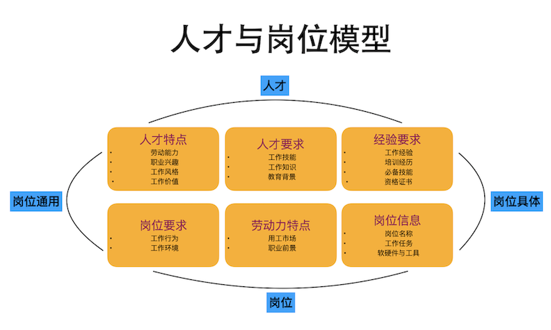

```{r setup, include=FALSE}
knitr::opts_chunk$set(echo = FALSE)
```

## 人才与岗位模型



## 岗位特征

- 岗位名称
- 工作任务
- 工作活动
- 工作环境
- 软硬件与工具
- 用工市场
- 职业前景

## 工作任务

指为完成目标而形成的一个动作或一系列动作的集合。

## 工作活动

在多个岗位上通用的工作行为类型，包括信息输入(5个)，大脑处理(10个)，工作输出(9个)，与人互动(17个) 。详见如下：

  - 信息输入(5个)：评估产品、事件或信息的可量化特征，获取信息，识别物体、动作和事件，检查设备、结构或材料，监视过程、材料或环境。
  - 大脑处理(10个)：分析数据或信息，制定目标和策略，评估信息以确定是否符合标准，判断物体、服务或人员的质量，做出决定和解决问题，组织、计划和优先工作，处理信息，安排工作和活动，创造性思维，更新和使用相关知识。
  - 工作输出(9个)：控制机器和过程，文档/记录信息，起草、布置和指定技术装置，零件和设备，处理和移动物体，使用计算机，操作车辆、机械或设备，进行一般的体力活动，维修和保养电子设备，维修和保养机械设备。
  
## 
  - 与人互动(17个)：协助和照顾他人，教练和开发他人，与组织外部的人员进行沟通，与主管、同级或下属进行沟通，协调他人的工作和活动，开发和建设团队，建立和维持人际关系，指导、指引和激励下属，为他人解释信息含义，监控资源，开展行政活动，为公众服务或直接与公众合作，向他人提供咨询和建议，销售或影响他人，组织单位人员编制，培训与教授他人。

## 工作环境

影响工作属性的物质因素和社交因素，包括人际关系(14个)，物理工作条件(30个)，工作结构特征(13个)。详见如下：

- 人际关系：描述人与人之间的互动过程。
  - 人际关系(14个)：与他人接触，协调或领导他人，与外部客户互动，与暴力或具有身体侵略性的人打交道，与生气或不礼貌的人打交道，电邮,面对面讨论，工作矛盾发生的频率，书信备忘，公开演讲，对工作结果负责，对他人的健康与安全负责，电话交谈，团队互动。

## 
- 物理工作条件：描述从业者与物理工作环境之间的互动。
  - 物理工作条件(30个)：狭隘空间、奇怪姿势，接触污染物（例如废料、废气、粉尘或异味)，疾病或感染环境，危险条件，接触危险设备，高处工作，遭受轻微的灼伤、割伤、咬伤或虫叮的频率，辐射环境，全身振动的环境，极度明亮或光线不足环境，封闭式的车辆或操作设备中工作，开放式的车辆或操作设备中工作，室内受控环境，室内不受控环境，户外各种天气，户外有遮盖，肢体接触，噪音环境，弯曲或扭转身体时长，攀爬梯子、脚手架、电线杆时长，保持或重获平衡时长，跪蹲弯腰或爬行时长，重复性动作，坐姿时长，站立时长，用手来操纵、控制或感觉物体、工具或控件时长，走路或跑步时长，高温或严寒环境，佩戴常见的防护或安全设备工作的频率，佩戴专门的防护或安全设备工作的频率。

##  
- 工作结构特征：涉及到从业者与工作之间的关系或互动。
  - 工作结构特征(13个)：犯错严重性，工作自动化程度，正常工作周时长，自由做决定，做决定的频率，所做决定对同事或公司的影响，精确度的重要性，重复相同任务的重要性，竞争程度，工作节奏随设备速度，结构化和非结构化工作，时限压力，工作安排。


## 软硬件与工具

指岗位需要从业者掌握的软件技能和工具使用技巧。

## 用工市场、职业前景

由于任何企业不是在真空中存活，它们存在于一定的社会和经济结构中，所以，人才和岗位模型中就必定离不开市场环境信息，对市场的理解要从广义范围上出发，不局限在用工市场信息，这类信息的来源包括各类政府机构，专业咨询顾问公司，企业信息搜集等。


## 人才特征

- 劳动能力
- 工作知识
- 工作技能
- 教育、培训、工作经验
- 工作风格
- 工作价值
- 职业兴趣

## 劳动能力

影响工作绩效的个体属性，包括认知(21个)，体能(9个)，运动(10个)和感观(12个)。详见如下：

- 认知(21个):分类灵活性，演绎推理，模式识别，流畅的思维，归纳推理，信息排序，数学推理，记忆力，数字计算，口语理解，口头表达，原创力，感知速度，问题敏感性，选择性注意，空间感知，模式响应，时间共享，可视化，书面理解，书面表达。

- 体能(9个)：动态灵活性，动态力量，爆发力，广泛的灵活性，身体整体协调，身体整体平衡，耐力，静态力量，腰背力量。

- 运动(10个)：手臂手掌稳定，控制精度，手指敏捷，手动敏捷，四肢协调，速率控制，反应时间，反应回馈，肢体运动速度，腕指速度。

- 感观(12个)：听觉注意，深度感知，远视，强光敏感度，听力敏感度，近视，夜视，周边视野，声音定位，语音清晰度，语音识别，视觉颜色辨别。


## 工作知识

运用于通用领域的原理和事实体系，包括33个知识分类。详见如下：

行政管理，生物，建筑与施工，化学，文书工作，传播与媒体，计算机与电子学，客户和个人服务，设计，经济与会计，教育培训，工程技术，英语，艺术，食品生产，外语，地理，历史与考古学，法律与政府，数学，机械学，医药与牙科，人事与人力资源，哲学与神学，物理，生产加工，心理学，公共安全与保障，销售与市场营销，社会学与人类学通，治疗与咨询，交通运输。


## 工作技能

已开发的促进学习或者快速获取知识的能力，包括基本技能(10个)，解决复杂问题(1个)，资源管理(4个)，社交技能(6个)，系统技能(3个)，技术能力(11个)。

- 基本技能(10个)：主动学习，积极聆听，批判性思维，学习策略，数学，监控，阅读理解，科学，说话，写作
- 社交技能(6个)：协调，指导，谈判，说服力，服务导向，社交知觉。
- 技术能力(11个)：设备维护,设备选择,安装,操作与控制,运营监控,运营分析，编程，质量控制分析，修理，技术设计，故障排除。
- 系统技能(3个)：判断与决策，系统分析，系统评估。
- 资源管理(4个)：财政资源管理，物质资源管理，人力资源管理，时间管理。

## 教育、培训、工作经验

  - 教育与培训：指岗位需要从业者具备的学历水平和相关培训经历。

  - 工作经验：指岗位需要从业者在相关工作领域的实践经历和技能训练。

## 工作风格

影响工作绩效表现的个性特征，包括16个类型。详见如下：

成就/努力，适应性/灵活性，分析式思维，注重细节，关心他人，合作，可靠性，独立性，主动性，创新，诚信，领导力，坚持不懈，自我控制，社交导向，抗压力 。


## 工作价值

工作能够满足个体需求的方面，包括6个类型。详见如下：

人际关系，工作条件，成就感，独立性，获得认可，支持。


## 职业兴趣

对工作环境和结果的偏好，包括6个类型。详见如下：

艺术型，传统型，进取型，调查型，实际型，社交型。


## 问卷说明
基于以上模型理论，问卷的使用帮助收集岗位分析数据，建立岗位数据库，让招聘以一种相对客观的方式在日常工作中进行，使招聘过程中参与的各方能够对所招岗位有个清晰的认识和方向把握，也为培训与开发，绩效管理提供依据和支持。

- [工作环境](http://darp.byethost24.com/JobAnalysis001_HRM/S007_%E5%B7%A5%E4%BD%9C%E7%8E%AF%E5%A2%83.pdf)

- [工作活动](http://darp.byethost24.com/JobAnalysis001_HRM/S006_%E5%B7%A5%E4%BD%9C%E6%B4%BB%E5%8A%A8.pdf)
- [工作风格](http://darp.byethost24.com/JobAnalysis001_HRM/S005_%E5%B7%A5%E4%BD%9C%E9%A3%8E%E6%A0%BC.pdf)

- [工作技能](http://darp.byethost24.com/JobAnalysis001_HRM/S002_%E6%8A%80%E8%83%BD.pdf)
- [工作知识](http://darp.byethost24.com/JobAnalysis001_HRM/S004_%E7%9F%A5%E8%AF%86.pdf)
- [工作能力](http://darp.byethost24.com/JobAnalysis001_HRM/S003_%E8%83%BD%E5%8A%9B.pdf)
- [背景](http://darp.byethost24.com/JobAnalysis001_HRM/S008_%E6%95%99%E8%82%B2_%E5%9F%B9%E8%AE%AD_%E5%B7%A5%E4%BD%9C%E7%BB%8F%E9%AA%8C.pdf)

## 问卷说明

- [职业兴趣](https://www.aliwork.com/APP_FV5EGSEDBFGP9S2UD3XJ/workbench/FORM-998664B1FKXOFEHK01AXWA7LBLZC2GXWII5NKE7?ddtab=true)
- [工作价值](http://darp.byethost24.com/JobAnalysis001_HRM/S001_%E5%B7%A5%E4%BD%9C%E4%BB%B7%E5%80%BC.pdf)

## 岗位人才画像示例

请参考：[薪酬绩效经理](http://darp.byethost24.com/JobAnalysis005_C&B/JobAnalysis005_C-B.html)

## 结语

招聘建立在实践的基础上，理论也源于实践，学以致用，活学活用，格物致知。


